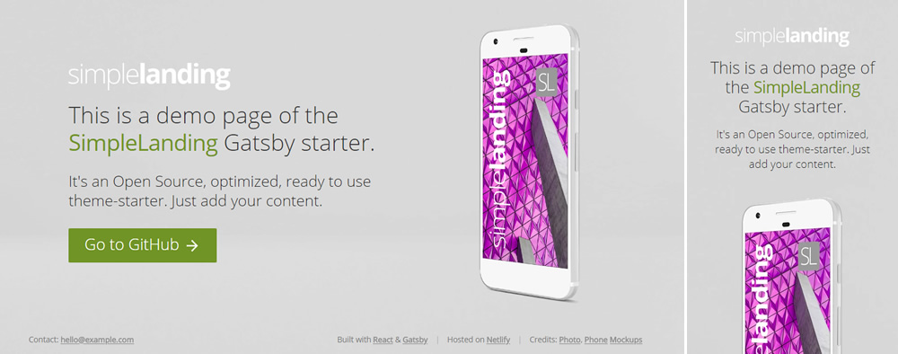

# SidebarBlog starter for Gatsby

[DEMO website](https://gssb.greglobinski.com/)



This is a starter/theme for [Gatsby](https://github.com/gatsbyjs/gatsby).

## Description

SidebarBlog lets you create optimized and ready to use landing page with no effort.

The starter uses the css-in-js library [JSS](https://github.com/cssinjs/jss) and its integration
for React [React-JSS](https://github.com/cssinjs/react-jss) to declare and mantain CSS styles.

## Setup

If you are completely new to Gatsby, start with one of its
[official starters](https://www.gatsbyjs.org/docs/gatsby-starters/). If you
have already went through with the
[tutorials](https://www.gatsbyjs.org/tutorial/) install the starter using
`gatsby new` command.

```
gatsby new [NEW_SITE_DIRECTORY_FOR_YOUR_BLOG] git@github.com:greglobinski/gatsby-starter-sidebar-blog.git
```

# Updates

If you are interested in updates follow me at
[@greglobinski](https://twitter.com/greglobinski).
