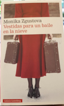

Título | Autor/a | Género | Editor | Traductor | Estado |
------ | ------- | ------ | ------ | --------- | ------ |
Vestidas para un baile en la nieve | Zgustova, Monika | Narrativa | Galaxia Gutemberg S.L. | Original en castellano | Seleccionado para el club del 19/6/2019|

Desde que Aleksandr Solzhenitsyn sorprendió al mundo con su libro Archipiélago Gulag, se han publicado diversos testimonios y estudios que han ido completando el retrato de lo que fue el mayor sistema de campos de trabajo forzado de la historia de la humanidad. 

Pero han sido sorprendentemente pocos los textos que han tratado la historia de las mujeres en el gulag. Como si ellas hubieran tenido un papel residual en los campos y en la brutal represión del régimen estalinista en general. Fue todo lo contrario. 

Monika Zgustova, una de las especialistas en literatura e historia rusas más importantes de nuestro país, ha buscado durante los últimos nueve años a las pocas mujeres que siguen con vida de entre las que sobrevivieron al gulag para escuchar y transmitir su testimonio antes de que se perdiera para siempre. Las ha visitado en sus hogares en Moscú, Londres y París, y el resultado, contra lo que pudiera parecer, es un canto a la vida, a la literatura, a la amistad, a todas las personas y a todo aquello que les permitió sobrevivir. 

A través de los recuerdos y los objetos, libros y cuadernos que perviven de ese tiempo, Vestidas para un baile en la nieve, (la policía secreta soviética se llevaba a sus víctimas en cualquier momento, también cuando estaban a punto de acudir a un baile) traza el retrato de nueve mujeres y su tiempo en el gulag pero también su regreso a la vida cotidiana. Nueve mujeres, científicas, actrices, maestras, matemáticas, poetas, que son otros tantos ejemplos de superación y de profunda humanidad|